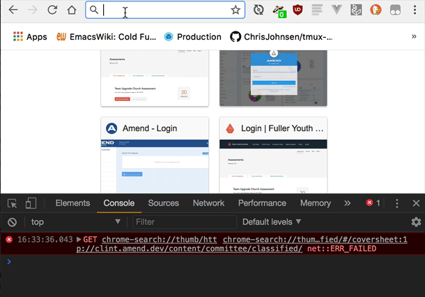

# angular-wp-workflow

Basic cf/webpack workflow proof of concept for concatenation/uglification of angular apps. Also uses the [common chunks plugin](https://webpack.js.org/plugins/commons-chunk-plugin/) for code shared between themes (e.g. `/app/script/util` and `/app/script/vendor`).

To try it, make a `127.0.0.1 webpack.dev` entry in hosts and add something like this to your apache vhosts:

```
<VirtualHost *:80>
   ServerAdmin email@domain.com
   DocumentRoot "/path/to/angular-wp-workflow"
   ServerName webpack.dev
   ServerAlias *.webpack.dev

   DirectoryIndex index.cfm index.html

  <Directory />
    Order allow,deny
    Allow from all
    AllowOverride All
    Options Indexes FollowSymLinks
  </Directory>

  <Directory "/path/to/angular-wp-workflow">
    Order allow,deny
    Allow from all
  </Directory>
</VirtualHost>
```

The default theme is sfrc and can be hit @ `webpack.dev` (or explicitly from `sfrc.webpack.dev`). Override theme is `ag.webpack.dev`. Common code is included and templates, scripts and styles are overridden:


